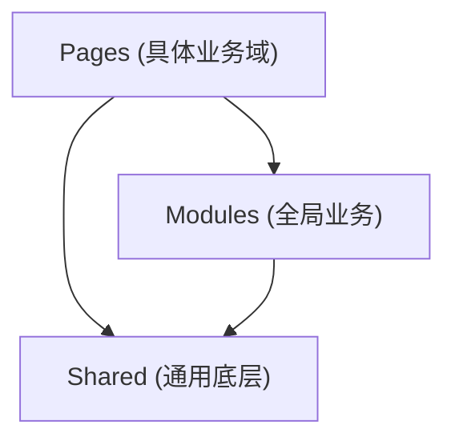

# 架构设计白皮书 (Architecture Whitepaper)

本文档详细阐述了本项目的架构设计哲学、分层结构以及核心依赖规则。

## 1. 架构设计哲学 (Architecture Philosophy)

本文档旨在为中大型项目提供一套可扩展、可维护、高内聚、低耦合的前端架构方案。本架构的设计哲学不是为了创建一套僵化的规则，而是为了构建一个能 **主动管理复杂度** 的开发环境。它旨在解决项目在演进过程中必然会遇到的“复杂度失控”问题。

### 1.1. 核心原则

1.  **域驱动设计 (Domain-Driven Design)**：代码组织的第一维度是“业务领域”，而不是“技术类型”。
2.  **显式分层 (Explicit Layering)**：严格区分“通用底层”、“全局业务”和“具体页面”，底层严禁反向依赖上层。
3.  **特性内聚 (Feature Cohesion)**：一个业务功能（特性）所需的所有代码（UI, 逻辑, API, 模型）都应被组织在一起。
4.  **视图/页面分离 (View/Page Separation)**：通过分离“路由壳”与“功能核”，实现路由解耦、健壮的缓存和极高的可复用性。
5.  **类型安全 (Type Safety)**：通过严格的 TypeScript 命名与 `as const` 约定，确保枚举与常量的可维护性。

## 2. 核心架构详解 (The "Why")

### 2.1. 分层架构与依赖流向

为了防止“意大利面条式依赖”，我们规定了严格的 **单向依赖流**：

*   **Shared (底层)**：无业务属性，包含 ui-kit (UI增强) 和通用工具。**严禁** 引用 Modules 或 Pages。
*   **Modules (中层)**：全站通用业务（如 Auth）。可以引用 Shared，但 **严禁** 引用 Pages。
*   **Pages (上层)**：具体的业务场景。可以引用下层，但 **严禁** 域之间互相直接引用（应通过路由跳转）。

### 2.2. Page vs. View：架构的基石

*   **`*.page.vue` (路由页 / “壳”)**
    *   **职责**：路由的唯一入口，keep-alive 的缓存锚点。
    *   **原则**：极“薄”。只负责从 `$route` 取参，传给 View。绝不包含业务逻辑。

*   **`*.view.vue` (业务视图 / “核”)**
    *   **职责**：100% 的业务功能实现。
    *   **原则**：与路由完全解耦。所需数据全靠 props 传入。这使得它可以被弹窗、侧边栏或其它页面随意复用（像搭积木一样）。

### 2.3. Feature 的粒度与边界 (Feature Granularity)

Feature 的拆分应基于**业务聚合**而非**UI 页面**。我们**强力反对**“一个页面一个 Feature”的机械拆分。

*   **实体一致性 (Identity Cohesion)**
    *   针对同一个核心业务实体（如“用户”、“订单”）的**列表、详情、新建、编辑**等所有视图，应属于**同一个 Feature**。
    *   **理由**：它们共享相同的 API 定义、数据模型 (Model) 和业务逻辑 (Composable)。如果拆分，会导致这些公共资源被迫下沉到 Shared 层，造成 Shared 层的臃肿和语义模糊。

*   **正确示例**
    *   **Feature**: `datasource` (数据源管理)
    *   **包含 Views**: `DataSourceList.view.vue` (列表), `DataSourceDetail.view.vue` (详情), `DataSourceEdit.view.vue` (编辑)。
    *   **共享资源**: `api/datasource.api.ts`, `models/DataSource.ts`。

### 2.4. 第三方增强 (UI Kit vs Core Plugins)

*   **初始化配置 (`src/core/plugins/`)**：决定库如何启动。例如 `echarts.ts` 注册主题，`antd.ts` 引入全局样式。
*   **运行时增强 (`src/shared/ui-kit/`)**：决定库如何更好用。
    *   `composables/`: 解决特定 UI 行为的逻辑（如 `usePopupContainer`）。
    *   `styles/`: 覆盖第三方库的样式文件。

## 3. 代码归属决策树 (Checklist)

在编写代码前，请按此清单自查：

1.  **这个类型放哪？**
    *   后端知道吗？知道 -> `models/`；不知道 -> `constants/`。
2.  **这个枚举单独建文件吗？**
    *   它是主实体的属性吗？是 -> 合并进主实体文件 (`User.ts`)。
    *   被多处引用？ -> 独立文件 (`UserStatus.ts`)。
3.  **列表和详情要分开吗？**
    *   操作同一个核心对象吗？是 -> **不分**，属于同一个 Feature。
4.  **API 参数类型放哪？**
    *   被复用？ -> `models/`。
    *   仅此接口用？ -> `api.ts` 顶部。
5.  **组件能调 API 吗？**
    *   是业务组件（搜索框）？ -> 能。
    *   是 UI 组件（卡片）？ -> 不能。
