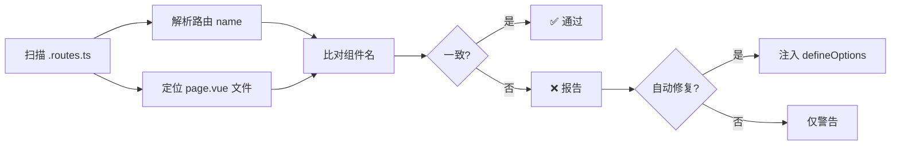

# 路由名称与组件名称一致性方案

> **版本**: 1.0
> **创建时间**: 2026-01-11
> **状态**: 待评审

---

## 1. 背景与问题

### 1.1. 当前问题

通过代码审查发现，项目中的 `*.page.vue` 文件存在以下问题：

| 文件 | 路由名称 | 组件 defineOptions | 状态 |
|:---|:---|:---|:---|
| `DatasourceManagementList.page.vue` | `DatasourceManagementList` | **缺失** | ❌ 不一致 |
| `DatasourceManagementDetail.page.vue` | `DatasourceManagementDetail` | **缺失** | ❌ 不一致 |
| `AlarmManagementList.page.vue` | `AlarmManagementList` | **缺失** | ❌ 不一致 |
| `AlarmManagementDetail.page.vue` | `AlarmManagementDetail` | **缺失** | ❌ 不一致 |

### 1.2. 规范要求

根据 `docs/CODING_STANDARDS.md` 第 1.5 节规定：

> **KeepAlive 缓存与组件命名规范**
>
> 1. **一致性**: `Route.name` 必须等于 `Component.name`
> 2. **显式定义**: 在 `.vue` 文件中必须使用 `defineOptions` 显式声明组件名
> 3. **唯一性**: 组件名必须是全局唯一的 PascalCase

### 1.3. 影响范围

- ❌ **KeepAlive 失效**: 没有显式组件名会导致缓存混乱
- ❌ **无法精确清除缓存**: 无法使用 `routerViewKey` 精确控制缓存生命周期
- ❌ **开发体验差**: 需要手动维护两处名称，容易出错

---

## 2. 解决方案设计

### 2.1. 方案概述

采用 **"检查 + 自动化 + 规范"** 三位一体的解决方案：

```
┌─────────────────────────────────────────────────────────────┐
│                    路由名称一致性保障体系                      │
├─────────────────────────────────────────────────────────────┤
│                                                             │
│  ┌──────────────┐    ┌──────────────┐    ┌──────────────┐  │
│  │   开发时检查   │    │  构建时验证   │    │  自动化同步   │  │
│  │              │    │              │    │              │  │
│  │  • ESLint    │    │  • TypeScript│    │  • 脚手架自动 │  │
│  │    规则      │    │    类型检查   │    │    生成      │  │
│  │  • Git Hook  │    │  • 单元测试   │    │  • 可选修复   │  │
│  └──────────────┘    └──────────────┘    └──────────────┘  │
│                                                             │
└─────────────────────────────────────────────────────────────┘
```

### 2.2. 核心方案：扩展 Vite 插件

#### 2.2.1. 设计思路

扩展现有的 `vite-plugin-route-names.ts` 插件，新增以下功能：

1. **名称一致性检查**: 扫描路由定义与 page.vue 组件名，比对是否一致
2. **自动注入 defineOptions**: 在构建时自动为 page.vue 添加缺失的 defineOptions
3. **生成验证报告**: 输出检查结果到控制台

#### 2.2.2. 工作流程



#### 2.2.3. 输出示例

```bash
[vite-plugin-route-names] 🔍 检查路由名称一致性...

✅ DatasourceManagementList.page.vue
   路由名: DatasourceManagementList
   组件名: DatasourceManagementList

❌ DatasourceManagementDetail.page.vue
   路由名: DatasourceManagementDetail
   组件名: (未定义)
   建议: 添加 defineOptions({ name: 'DatasourceManagementDetail' })

汇总: 4 个路由, 1 个问题
```

---

## 3. 实现方案详情

### 3.1. 方案 A：最小改动方案 (推荐)

#### 功能定位
- 仅在开发环境运行检查
- 不修改源文件，仅输出报告
- 零风险，向后兼容

#### 实现步骤

**步骤 1**: 扩展插件，添加组件名检查逻辑

```typescript
// internal/build-tools/src/plugins/vite-plugin-route-names.ts

// 新增函数：检查 page.vue 的 defineOptions
function checkPageComponentName(pagePath: string, expectedName: string): {
  hasDefineOptions: boolean;
  actualName: string | null;
  isMatch: boolean;
} {
  // 1. 读取 page.vue 文件内容
  // 2. 使用 AST 解析 defineOptions
  // 3. 比对组件名与路由名
  // 4. 返回检查结果
}
```

**步骤 2**: 在插件中集成检查逻辑

```typescript
export function autoRoutesPlugin(): Plugin {
  return {
    name: "vite-plugin-auto-route-names",
    buildStart() {
      generateNames();
      checkRouteNameConsistency(); // 新增
    },
    // ...
  };
}
```

**步骤 3**: 添加 package.json 脚本

```json
{
  "scripts": {
    "check:route-names": "tsx internal/build-tools/src/scripts/check-route-names.ts"
  }
}
```

#### 优点与缺点

| 优点 | 缺点 |
|:---|:---|
| ✅ 零风险，不修改源码 | ⚠️ 需要手动修复 |
| ✅ 立即生效，无迁移成本 | ⚠️ 依赖开发者自觉 |
| ✅ 完美集成现有插件 | |
| ✅ CI/CD 友好 | |

---

### 3.2. 方案 B：自动修复方案

#### 功能定位
- 检查 + 自动注入 defineOptions
- 支持一次性修复所有文件
- 需要开发者确认

#### 实现步骤

**步骤 1**: 创建独立修复脚本

```bash
# scripts/fix-route-names.ts
# 1. 扫描所有 page.vue
# 2. 检查是否有 defineOptions
# 3. 自动注入缺失的 defineOptions
# 4. 生成修复报告
```

**步骤 2**: 添加自动修复命令

```json
{
  "scripts": {
    "fix:route-names": "tsx scripts/fix-route-names.ts"
  }
}
```

**步骤 3**: 修改 page.vue 模板

```vue
<!-- 脚手架生成的模板自动包含 defineOptions -->
<script setup lang="ts">
/**
 * [功能名称] - 路由页 (Page Shell)
 * @route [路由路径]
 */
defineOptions({
  name: '__COMPONENT_NAME__' // 脚手架自动替换
});
</script>
```

#### 优点与缺点

| 优点 | 缺点 |
|:---|:---|
| ✅ 一劳永逸 | ⚠️ 修改源文件 |
| ✅ 新代码自动符合规范 | ⚠️ 需要一次性修复旧文件 |
| ✅ 减少人工错误 | |

---

### 3.3. 方案 C：ESLint 规则方案 (补充)

#### 功能定位
- 开发时实时提示
- 阻止不符合规范的提交

#### 实现步骤

**步骤 1**: 创建自定义 ESLint 规则

```javascript
// eslint-rules/route-name-match.js
module.exports = {
  meta: {
    type: 'problem',
    docs: {
      description: 'Ensure page.vue component name matches route name',
    },
  },
  create(context) {
    return {
      // 实现规则逻辑
    };
  },
};
```

**步骤 2**: 配置 .eslintrc

```json
{
  "rules": {
    "@project/route-name-match": "error"
  }
}
```

#### 优点与缺点

| 优点 | 缺点 |
|:---|:---|
| ✅ 开发时实时反馈 | ⚠️ 需要额外维护规则 |
| ✅ IDE 集成良好 | ⚠️ 实现复杂度高 |
| ✅ 可防止不合规提交 | |

---

## 4. 推荐实施路径

### 阶段一：立即实施 (方案 A)

```bash
# 1. 扩展现有插件，添加检查逻辑
# 2. 集成到开发服务器
pnpm dev  # 自动运行检查

# 3. 添加独立检查命令
pnpm check:route-names  # CI/CD 集成
```

**时间投入**: 2-3 小时
**风险**: 极低

### 阶段二：存量修复 (方案 B)

```bash
# 1. 运行自动修复脚本
pnpm fix:route-names

# 2. 检查修复结果
pnpm check:route-names

# 3. 提交修复
git add .
git commit -m "fix: add defineOptions to all page.vue for KeepAlive"
```

**时间投入**: 1-2 小时
**风险**: 低（可先在分支测试）

### 阶段三：持续保障 (方案 C，可选)

```bash
# 1. 开发 ESLint 规则
# 2. 集成到 pre-commit hook
# 3. 配置 CI/CD 检查
```

**时间投入**: 4-6 小时
**风险**: 中（需要充分测试）

---

## 5. 关键文件清单

### 需要修改的文件

| 文件路径 | 修改内容 | 优先级 |
|:---|:---|:---|
| `internal/build-tools/src/plugins/vite-plugin-route-names.ts` | 添加组件名检查逻辑 | P0 |
| `package.json` | 添加 check/fix 脚本 | P0 |
| `scripts/scaffold-core/template.ts` | 更新 page.vue 模板 | P1 |
| `.eslintrc.*` | 添加自定义规则 (可选) | P2 |

### 需要修复的 page.vue 文件

| 文件路径 | 当前状态 | 需要添加 |
|:---|:---|:---|
| `src/pages/datasource-management/pages/DatasourceManagementList.page.vue` | 无 defineOptions | `defineOptions({ name: 'DatasourceManagementList' })` |
| `src/pages/datasource-management/pages/DatasourceManagementDetail.page.vue` | 无 defineOptions | `defineOptions({ name: 'DatasourceManagementDetail' })` |
| `src/pages/alarm-management/pages/AlarmManagementList.page.vue` | 无 defineOptions | `defineOptions({ name: 'AlarmManagementList' })` |
| `src/pages/alarm-management/pages/AlarmManagementDetail.page.vue` | 无 defineOptions | `defineOptions({ name: 'AlarmManagementDetail' })` |

---

## 6. 风险评估与缓解

| 风险 | 影响 | 概率 | 缓解措施 |
|:---|:---:|:---:|:---|
| 插件解析错误导致构建失败 | 高 | 低 | 充分测试 AST 解析逻辑 |
| 自动修复破坏现有代码 | 中 | 低 | 添加 Git 备份，支持回滚 |
| 与现有脚手架冲突 | 低 | 低 | 复用现有模板引擎 |
| 性能影响 | 低 | 中 | 仅在开发环境运行 |

---

## 7. 成功标准

### 7.1. 技术指标

- [ ] 所有 page.vue 都包含 defineOptions
- [ ] 组件名与路由名 100% 一致
- [ ] 插件运行时间 < 500ms
- [ ] 零误报（False Positive）

### 7.2. 开发体验

- [ ] `pnpm dev` 启动时自动检查
- [ ] 检查结果清晰易懂
- [ ] 新建 domain/feature 自动符合规范

---

## 8. 后续优化方向

1. **支持嵌套路由**: 检查多层路由的命名一致性
2. **智能命名建议**: 基于文件路径自动推荐组件名
3. **可视化界面**: 在菜单编辑器中展示检查结果
4. **与 KeepAlive 集成**: 提供缓存管理工具

---

## 9. 附录

### A. 参考文档

- [Vue Router KeepAlive](https://router.vuejs.org/guide/advanced/meta.html)
- [Vue defineOptions](https://vuejs.org/api/sfc-script-setup.html#defineoptions)
- [项目架构白皮书](./ARCHITECTURE.md)
- [开发规范手册](./CODING_STANDARDS.md)

### B. 相关 Issue

- (待创建)

### C. 变更日志

| 版本 | 日期 | 变更内容 | 作者 |
|:---|:---|:---|:---|
| 1.0 | 2026-01-11 | 初始版本 | Claude Code |
