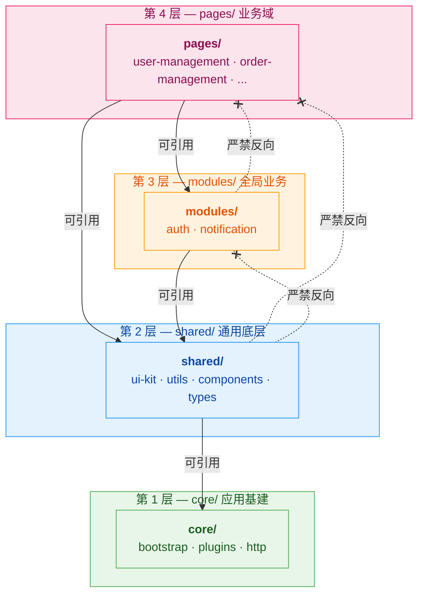
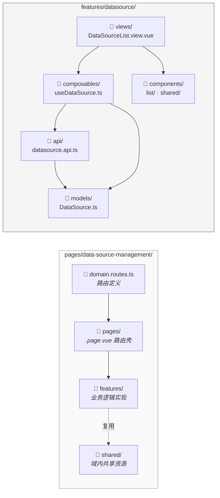
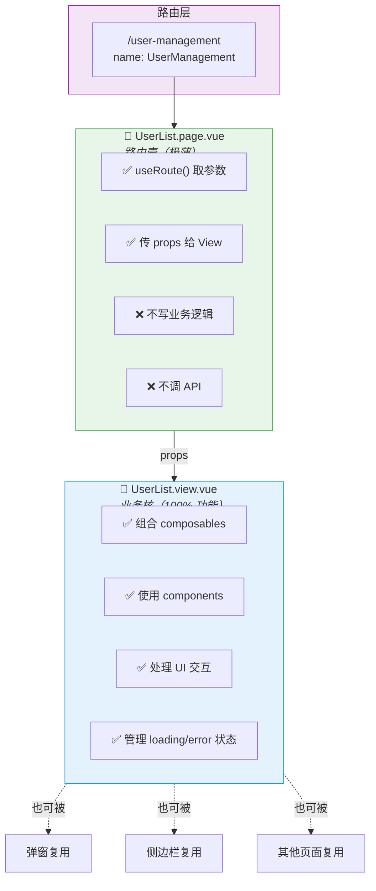
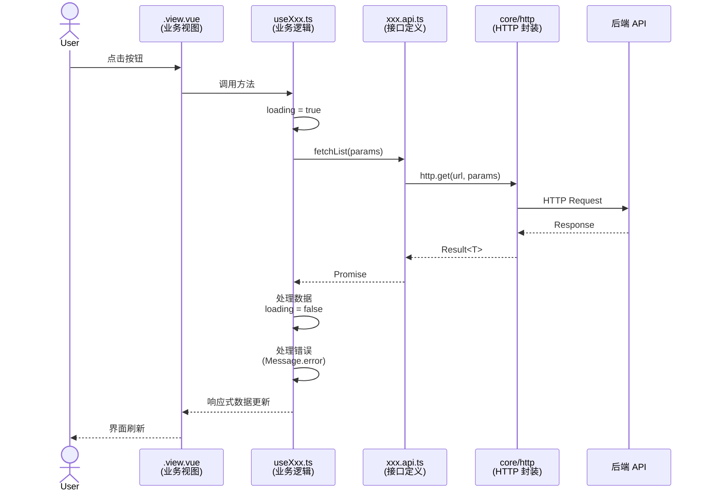
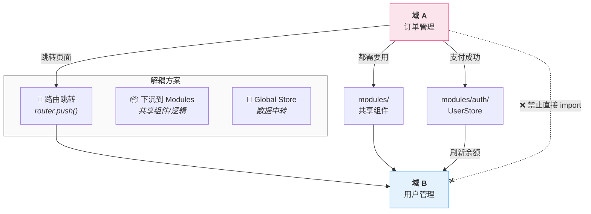
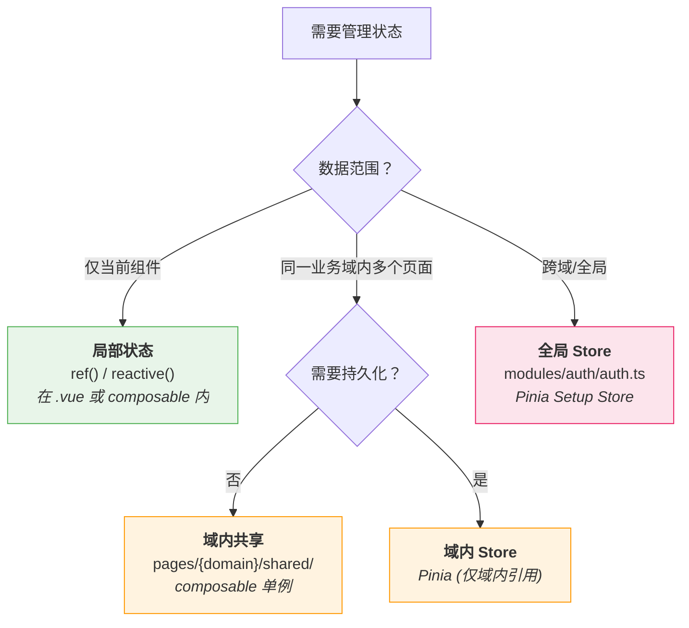
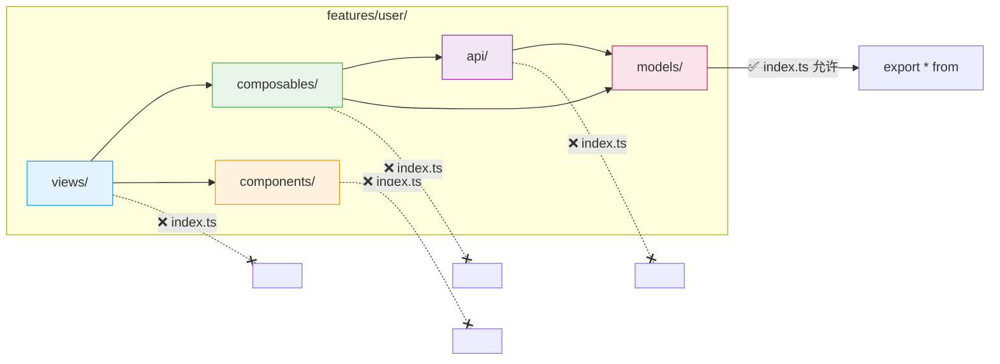

# 架构概览 (Architecture Overview)

本文档用图表帮助新人快速理解项目架构。详细规范请参考 `features-demo/README.md`。

---

## 核心原则

本架构围绕五条核心原则组织，下文各章节均是它们的展开：

1. **域驱动设计 (Domain-Driven Design)**：代码组织的第一维度是"业务领域"，而不是"技术类型"。
2. **显式分层 (Explicit Layering)**：严格区分"通用底层"、"全局业务"和"具体页面"，底层严禁反向依赖上层。
3. **特性内聚 (Feature Cohesion)**：一个业务功能（特性）所需的所有代码（UI、逻辑、API、模型）都应被组织在一起。
4. **视图/页面分离 (View/Page Separation)**：通过分离"路由壳"与"功能核"，实现路由解耦、健壮的缓存和极高的可复用性。
5. **类型安全 (Type Safety)**：通过严格的 TypeScript 命名与 `as const` 约定，确保枚举与常量的可维护性。

---

## 1. 分层与依赖流向

项目分为四层，依赖方向 **只能向下**，严禁反向。



**记忆口诀**：

| 层级 | 放什么 | 能引用谁 |
|:---|:---|:---|
| **core** | 应用启动、插件初始化、HTTP 封装 | 被任何层使用 |
| **shared** | 无业务的通用工具（utils、ui-kit） | 只能引用 core |
| **modules** | 跨域复用的业务模块（auth） | shared |
| **pages** | 具体业务功能 | modules、shared |

### 第三方增强 (UI Kit vs Core Plugins)

分层职责在增强第三方库时有一套固定分工：

- **初始化配置 (`src/core/plugins/`)**：决定库如何启动。例如 `echarts.ts` 注册主题，`antd.ts` 引入全局样式。
- **运行时增强 (`src/shared/ui-kit/`)**：决定库如何更好用。
  - `composables/`：解决特定 UI 行为的逻辑（如 `usePopupContainer`）。
  - `styles/`：覆盖第三方库的样式文件。

---

## 2. 业务域内部结构

每个业务域 (`pages/{domain}/`) 内部遵循统一的四件套：



**核心规则**：
- 路由壳 (`pages/`) 极薄，不含业务逻辑
- 特性 (`features/`) 是自包含的"积木"，所有相关代码都在一起
- 域内共享 (`shared/`) 仅存放本域多个特性复用的资源

### 轻量域

只有 1 个功能模块、不需要独立 api/models 层时，使用扁平化的轻量结构：

```
pages/login/
├── login.routes.ts
├── Login.page.vue
├── assets/
│   └── logo.svg
├── components/
│   └── LoginForm.vue
├── composables/
│   ├── useLoginForm.ts
│   ├── useCaptcha.ts
│   └── useRsaEncrypt.ts
├── constants.ts
└── views/
    └── Login.view.vue
```

**标准域 vs 轻量域：**

| 目录 | 标准域 | 轻量域 |
|---|---|---|
| `routes.ts` | ✅ | ✅ |
| `pages/` | ✅ 多路由壳 | ❌ 单页面直接放根 |
| `features/` | ✅ 按功能拆子目录 | ❌ 扁平化 |
| `views/` | `features/*/views/` | ✅ 根级 |
| `composables/` | `features/*/composables/` | ✅ 根级 |
| `components/` | `features/*/components/` | ✅ 根级 |
| `api/` | `features/*/api/` | ❌ 不需要 |
| `models/` | `features/*/models/` | ❌ 不需要 |
| `constants.ts` | `features/*/constants/` | ✅ 单文件 |
| `assets/` | — | ✅ 域内静态资源 |

**判断标准：** 只有 1 个功能模块且不需要独立 API 层 → 轻量域；否则 → 标准域。

### Feature 粒度与边界 (Feature Granularity)

Feature 的拆分应基于**业务聚合**而非 **UI 页面**，避免"一个页面一个 Feature"的机械拆分。

- **实体一致性 (Identity Cohesion)**：针对同一个核心业务实体（如"用户"、"订单"）的**列表、详情、新建、编辑**等所有视图，应属于**同一个 Feature**。它们共享相同的 API 定义、数据模型 (Model) 和业务逻辑 (Composable)；若强行拆分，这些公共资源会被迫下沉到 `shared/` 层，造成底层臃肿和语义模糊。
- **示例**：`datasource`（数据源管理）作为一个 Feature，包含 `DataSourceList.view.vue`（列表）、`DataSourceDetail.view.vue`（详情）、`DataSourceEdit.view.vue`（编辑），并共享 `api/datasource.api.ts` 与 `models/DataSource.ts`。

---

## 3. Page vs View 分离

这是架构最核心的设计——把"路由壳"和"业务核"分开：



**为什么？** View 与路由解耦后，可以被弹窗、侧边栏、Tab 面板等任意场景复用，像搭积木一样组合。

---

## 4. 数据流

从用户交互到后端请求的单向数据流：



**关键规则**：
- **API 层**只发请求，不处理 UI（禁止 `Message.error`）
- **Composable 层**处理业务逻辑、loading/error 状态、UI 反馈
- **View 层**只组合 composables 和 components，不直接调 `http.get`

---

## 5. 跨域交互

不同业务域之间禁止直接 import，通过三种方式交互：



| 场景 | 方案 | 示例 |
|:---|:---|:---|
| 跳转到另一个域的页面 | `router.push()` | 订单列表 → 用户详情 |
| 两个域共用组件/逻辑 | 下沉到 `modules/` | 用户头像组件 |
| 一个域的操作影响另一个域的数据 | Global Store 中转 | 订单支付 → 更新用户余额 |

---

## 6. 状态管理决策树

不是所有状态都需要 Pinia，按场景选择：



**优先级**：局部状态 > 域内共享 > 全局 Store。能用 `ref()` 解决的不要上 Pinia。

---

## 7. 引用规则速查



| 目录 | index.ts | 原因 |
|:---|:---|:---|
| components/ | 禁止 | 强迫完整路径，防止跨边界引用 |
| composables/ | 不推荐 | 显式路径避免循环依赖 |
| api/ | 禁止 | 防止循环依赖 |
| models/ | 允许 | 类型在编译后消失，无运行时风险 |

---

## 8. 代码归属决策树 (Checklist)

编写代码前，按此清单自查归属：

1. **这个类型放哪？** 后端知道 → `models/`；不知道 → `constants/`。
2. **这个枚举单独建文件吗？** 是主实体的属性 → 合并进主实体文件（如 `User.ts`）；被多处引用 → 独立文件（如 `UserStatus.ts`）。
3. **列表和详情要分开吗？** 操作同一个核心对象 → **不分**，属于同一个 Feature（见 §2「Feature 粒度与边界」）。
4. **API 参数类型放哪？** 被复用 → `models/`；仅此接口用 → `api.ts` 顶部。
5. **组件能调 API 吗？** 是业务组件（如搜索框）→ 能；是 UI 组件（如卡片）→ 不能。
